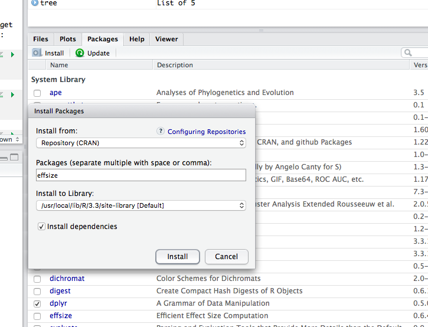

--- 
title: "Understanding Statistical Thinking With Linear Models"
author: "Dan MacLean"
date: "`r Sys.Date()`"
site: bookdown::bookdown_site
documentclass: book
bibliography: [book.bib, packages.bib, citations.bib]
biblio-style: apalike
link-citations: yes
description: ""
---

# Introduction to statistics

The primary purpose of this handbook is to help you to understand how to use statistics that will help with your research. The handbook will try to explain statistics using the same path through the topic that statistic students are educated along, but without the rigorous mathematical background necessary for those students. Instead this book will focus on making you aware of the major concepts and help you to be a better user of statistics in your research.

## Prerequisites

There are no specific knowledge prerequisites for this book but it will help if you have heard of some common statistical tests, like `t`, `ANOVA` and regression.


You need to install the following stuff for this book: 

 1. R
 2. RStudio
 3. Some R packages: `devtools`, `gradethis` and `itssl`
 

## Installing R

Follow this link and install the right version for your operating system [https://www.stats.bris.ac.uk/R/](https://www.stats.bris.ac.uk/R/)

## Installing RStudio

Follow this link and install the right version for your operating system [https://www.rstudio.com/products/rstudio/download/](https://www.rstudio.com/products/rstudio/download/)

## Installing R packages in RStudio.
### Standard packages - `devtools`

`devtools` is a standard R package and can be installed like any other you may have done from CRAN. Start RStudio and use the `Packages` tab in lower right panel. Click the install button (top left of the panel) and enter the package name, then click install as in this picture



### Development packages - `gradethis` and `itssl`

`gradethis` is a development package that allows us to use interactive tutorials, but it is somewhat new and still under development so we need to install it manually using `devtools`.

  1. In the `Console` tab in the lower left panel of RStudio type `devtools::install_github("rstudio-education/gradethis")`
  2. When you are asked 
    
    >These packages have more recent versions available.
      It is recommended to update all of them.
      Which would you like to update?

  Select `1: All`
  
`itssl` is a new package that contains all the materials including the exercises for this handbook. As it isn't fully certified yet you need to install it using `devtools`.

  1. In the `Console` tab in the lower left panel of RStudio type `devtools::install_github("danmaclean/itssl")`

## Using the `itssl` package

`itssl` is a package developed solely to accompany this course, the initialism stands for `intro to stats SL`. Once it is installed you can load it as usual - `library(itssl)`

All the functions in `itssl` follow this naming scheme `its_<something-something>_time()` so you'll be able to spot them as you read along. The main purpose of the functions is to make the course easier to follow and stop us from getting bogged down in a lot of circumstantial code that isn't directly related to our current point, which will usually be statistical rather than related to programming, hence you'll be able to get a lot out of this course even if you haven't used much R before. 

If you do have a desire to see the code inside the `itssl` functions it is available at [https://github.com/danmaclean/itssl/tree/master/R](https://github.com/danmaclean/itssl/tree/master/R)

## Acknowledgements

This handbook would not have been possible without helpful inspiration from these web pages and leaders in statistical education, please check out their sites.

 * [Danielle Navarro - Learning Statistics with R](https://learningstatisticswithr.com/)
 * [Jim Frost - Statistics By Jim](https://statisticsbyjim.com/)
 * [Jonas Kristoffer Linedlov](https://lindeloev.github.io/tests-as-linear/)

```{r include=FALSE}
# automatically create a bib database for R packages
knitr::write_bib(c(
  .packages(), 'bookdown', 'knitr', 'rmarkdown'
), 'packages.bib')
```
